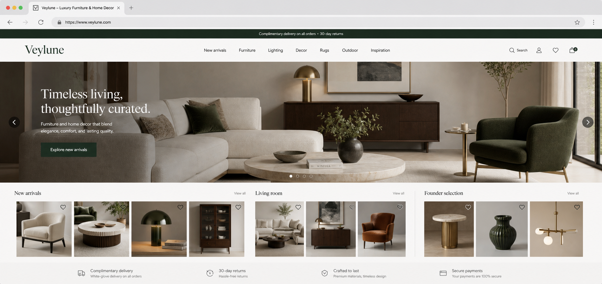

# Veylune Studio

**Veylune Studio** is a luxury furniture and home decor commerce platform built on **Shopware 6.7**, designed around curated collections, architectural product discovery, and a scalable supplier-driven catalog architecture.

The project focuses on creating a premium shopping experience inspired by modern commerce systems while maintaining strict governance, controlled publication workflows, and long-term scalability.

---

## Overview

Veylune is not a traditional online store.

It is designed as a commerce platform capable of supporting:

* Multiple suppliers
* Product family and variant management
* Curated collections
* Room-based product discovery
* Governance-driven publication workflows
* Scalable catalog growth

The architecture is designed to evolve from an initial curated catalog into a large-scale supplier ecosystem without requiring a storefront redesign.

---

## Key Features

### Product Family Architecture

Products are modeled as families with support for:

* Multiple sizes
* Multiple materials
* Multiple finishes
* Multiple color variations
* Variant-specific pricing
* Variant-specific media

---

### Curated Commerce Experience

The storefront is organized around:

* Founder Selections
* New Arrivals
* Room-based discovery
* Collection-driven merchandising
* Architectural product storytelling

---

### Governance & Publication Controls

The platform follows a fail-closed approach:

* Draft products remain private
* Publication requires approval workflows
* Search, SEO, and exposure are controlled
* Preview environments are isolated from public storefronts

---

### Supplier-Ready Foundation

The platform is designed for future supplier onboarding with support for:

* Supplier-specific catalogs
* SKU governance
* Product mapping
* Import pipelines
* Asset management
* Scalable variant structures

---

## Technology Stack

### Backend

* PHP 8+
* Shopware 6.7
* Symfony
* Doctrine

### Frontend

* Twig
* SCSS
* JavaScript

### Development

* DDEV
* Docker
* Git

---

## Architecture Highlights

* Commerce-first architecture
* Product family modeling
* Variant-ready catalog structure
* Room and collection taxonomy
* Governance-driven publication process
* Preview-only catalog review environments
* Scalable supplier integration strategy

---

## Current Status

The project is currently focused on:

* Catalog architecture
* Product family modeling
* Supplier onboarding readiness
* Commerce governance
* Scalable storefront structure

Future phases include:

* Supplier integrations
* Advanced product import pipelines
* Search and filtering systems
* Public catalog activation
* Checkout and fulfillment expansion

---

## Project Goal

Build a premium commerce platform capable of supporting a curated luxury catalog today while remaining scalable enough to support a large supplier-driven ecosystem in the future.

---

## Author

**Mohammad Reza Zaeri**

GitHub: https://github.com/mohammad-reza99
